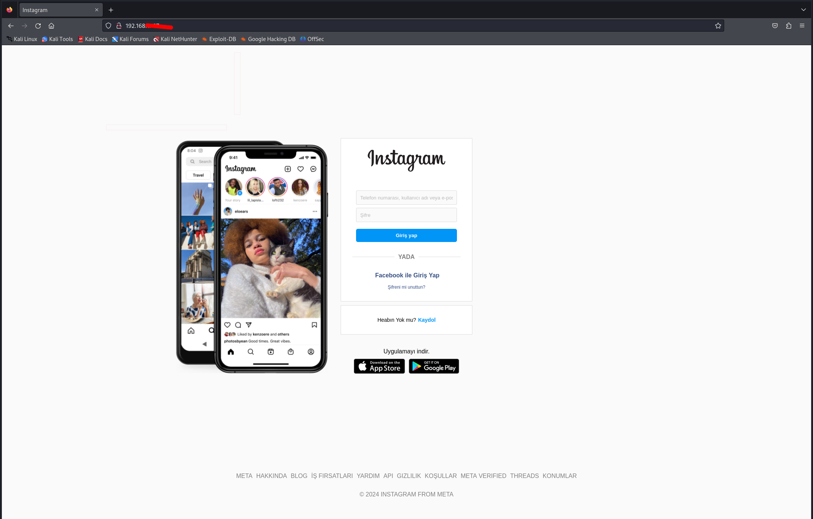
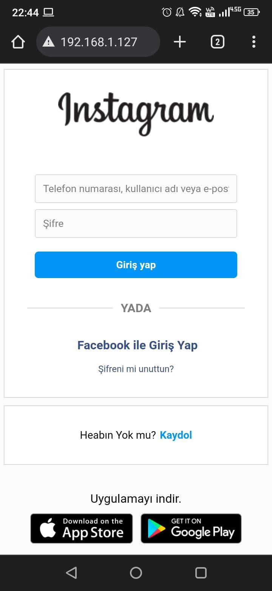
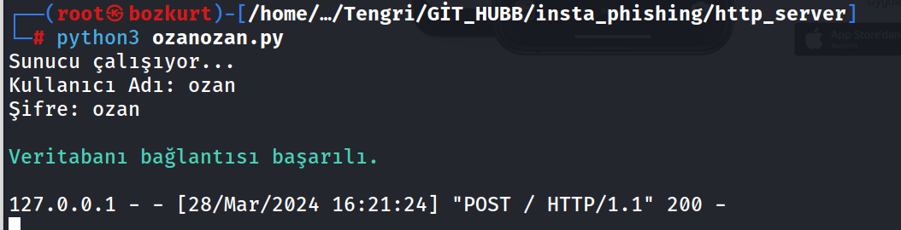
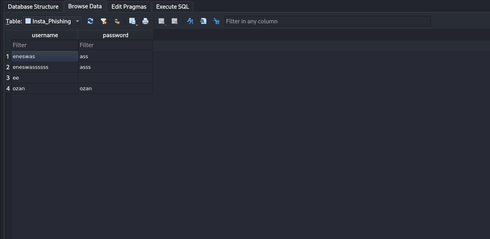

# insta_phishing :link:	

__*Instagram Phishing Tool*__

************

# :inbox_tray: Installation :inbox_tray:

    git clone https://github.com/ozan-B/insta_phishing.git

    cd insta_phishing

    sudo su 

    python3 setup.py

    python3 http_server/ozanozan.py

****************

# :pencil: Description :pencil:

* Merhaba , bu phishing aracını setoolkit aracını kullanırken bir çok hata aldığım için yazdım . Araç local de çalışıyor ancak bir kaç düzenleme ile , (mesela ngrok kullanarak vb.) aracı internete de açabilirsiniz . Araç kali linuxta kullanılmak için oluşturulmuştur .

- Installation başlığının altındakileri anlatayım biraz , önce root olmanız gerek , daha sonra setup.py scriptini çalıştırın , bu script insta_login_clone dizininin altındaki dosyaları /var/www/html dizinine otomatik olarak kopyalar ve apache serverımızı başlatır .

-  Daha sonra http_server dizininin altındaki ozanozan.py scriptini çalıştırın bu http serverımız . 

- Installation başlığının altındaki  komutları yazdığınız zaman tek yapmanız gereken browsera localhost yazıp entera basmanız . İşleri oldukça kolaylaştırmaya çalıştım .

- Bu işlemleri doğru yaptıysanız şimdi sırada atak zamanı !!!

- Url'i kurbana açtırmanız gerek , bunu qrcode veya bir phishing maili göndererek yapabilirsiniz artık bu sizin hayal gücünüze kalmış . 

- Daha sonra kurban , kullanıcı adı ve şifreyi girip Giriş Yap butonuna tıklayacak , tıkladıktan sonra kullanıcıya orijinal https://www.instangram.com  sitesi açılacak . Kullanıcı şifresini çalındığını değil yanlış şifre girdiğini düşünecek çünkü sayfa yenilenmiş gibi gözükecek . Bu kullanıcının aldatıldığını hemen anlamaması için bir önlem . 

- Kullanıcı bilgilerini grip butona tıkladığı anda java script kodumuz http serverımıza kullanıcı adı ve şifreyi POST edicek ve terminalde bu bilgiler ekrana yazılacak.

- Bilgiler ekrana yazıldıktan sonra http_server dizini altındaki insta_phish.db adlı database'e kaydedilecek .Böylece bilgileri daha sonra kullanabileceğiz .

*************

# :camera_flash:Desktop Screenshot   :camera_flash:

*********
# :camera_flash:Mobile Screenshot   :camera_flash:

*********

# :camera_flash:output of http server   :camera_flash:

*********

# :camera_flash:data base view   :camera_flash:

*********

## Bu yazılım yalnızca yasal ve etik amaçlar için kullanılmalıdır. Bu araç, izinsiz erişim, siber saldırı veya diğer yasa dışı faaliyetlerde kullanılmamalıdır. Kötü niyetli kullanım, yasal yaptırımlara, hukuki sorumluluklara ve ciddi sonuçlara neden olabilir. Bu nedenle, bu aracı yasal ve etik sınırlar içinde kullanmaya özen göstermelisiniz. Geliştirici veya dağıtıcı, bu aracın kötüye kullanımından doğacak herhangi bir sorumluluğu reddeder.

